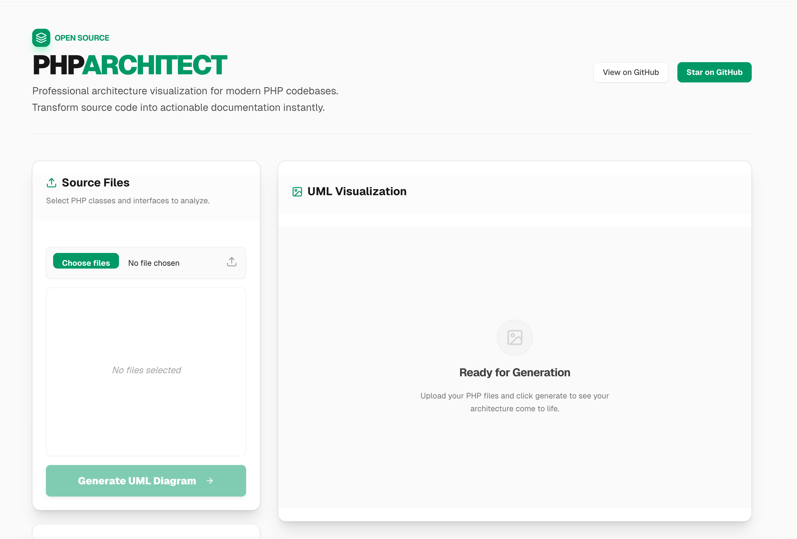

# PHP Architect




A professional, modern tool that automatically generates UML class diagrams from PHP source code. Visualize your architecture instantly with a sleek, premium interface.

## Features

-   **Instant Visualization**: Upload PHP files and see interactive UML class diagrams in seconds.
-   **No Background Dependencies**: Powered by a Node.js AST parser—no PHP runtime required on the server.
-   **Premium UI**: Built with Next.js, Tailwind CSS, and Shadcn UI for a fast, responsive, and gorgeous experience.
-   **Export Capability**: Download your architectural diagrams as high-resolution PNG images.
-   **Multi-file Support**: Analyze complex relationships across multiple classes and interfaces simultaneously.
-   **Standard Notation**: Supports standard UML notation including visibility, relationships (extends/implements), and methods.

## Getting Started

### Prerequisites

-   Node.js 20.x or higher
-   npm, yarn, or pnpm

### Installation

1.  **Clone the repository**
    ```bash
    git clone https://github.com/AzarguNazari/PHP-To-UML.git
    cd PHP-To-UML
    ```

2.  **Install dependencies**
    ```bash
    npm install
    ```

3.  **Run in development mode**
    ```bash
    npm run dev
    ```
    Access the application at `http://localhost:3000`.

## Technology Stack

-   **Framework**: [Next.js 16](https://nextjs.org/)
-   **Language**: [TypeScript](https://www.typescriptlang.org/)
-   **Styling**: [Tailwind CSS](https://tailwindcss.com/) & [Shadcn UI](https://ui.shadcn.com/)
-   **Parser**: [php-parser](https://www.npmjs.com/package/php-parser)
-   **Diagram Engine**: [nomnoml](http://www.nomnoml.com/)

## Contributing

Contributions are what make the open source community such an amazing place to learn, inspire, and create. Any contributions you make are **greatly appreciated**. Please read [CONTRIBUTING.md](CONTRIBUTING.md) for details.

## License

This project is licensed under the MIT License - see the [LICENSE](LICENSE) file for details.
